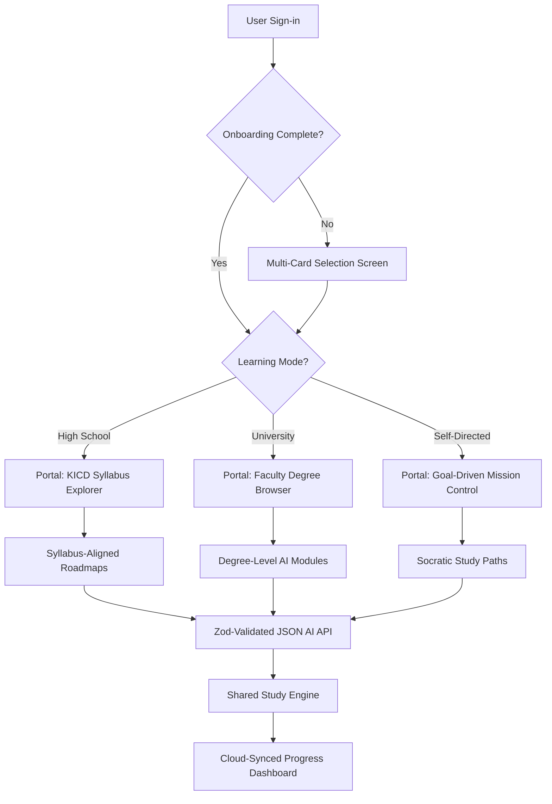

# 🎓 EasyTutor v1.0: Infinite AI Learning Architecture
*The "Professor" that adapts to any student. From KICD High School to University Degree programs.*

[](https://expo.dev)
[](https://anthropic.com)
[](https://supabase.com)
[](https://tailwindcss.com)

---

## 🌟 The Vision
**EasyTutor** is not just an AI wrapper; it is a **multi-portal academic operating system**. 
Built on a "Universal Professor" architecture, it detects whether a user is a **Kenyan High Schooler** (KICD syllabus), a **University Undergraduate** (Rigified Degree paths), or a **Self-Directed Learner** (Socratic Goal-driven), and dynamically re-architects its UI, system prompts, and curriculum generation logic to match.

---

## 🏛️ System Architecture: The "Professor" Model

EasyTutor uses a tiered redirection and orchestration strategy:



---

## 🚀 Key Portal Features

### 🇰🇪 **Portal 1: High School (KICD-Aligned)**
- **Curriculum Native**: Pre-seeded with 12 Core KCSE subjects from Mathematics to Computer Studies.
- **Form-Level Content**: Topics are categorized by Form 1–4 to ensure exam-readiness.
- **KICD Context**: AI prompts are culturally and academically tuned for the Kenyan secondary system.

### 🎓 **Portal 2: University (Academic Rigor)**
- **Scholarly Depth**: Subjects include Medicine, Mechanical Engineering, Law, and Architecture.
- **Degree-Level AI**: System prompts shift from basic explanations to undergraduate-level academic logic.
- **Integrated Exams**: challenging 15-question simulators designed for degree mastery.

### 🧭 **Portal 3: Self-Directed (Explorer Mode)**
- **Goal Mission Control**: Enter any learning goal (e.g., "Build a React-Native bridge") and get an instant architected roadmap.
- **Socratic Guidance**: The AI focuses on questioning and deepening understanding rather than just lecturing.

---

## 🛠️ The Tech Stack (EasyTutor v1.0)

- **Frontend**: **React Native v0.7x** with **Expo SDK 55**.
- **State Management**: **Zustand** with high-performance persistence using **AsyncStorage**.
- **Database Architecture**: **Supabase PostgreSQL** with strict Row-Level Security (RLS) for student data isolation.
- **AI Orchestration**: 
  - **Primary**: Claude 3.5 Sonnet (via Anthropic SDK).
  - **Secondary**: Llama 3.1 8B (via Groq API) for high-speed fallback.
  - **Formatting**: **Zod Schemas** for 100% predictable AI JSON outputs.

---

## 📐 Engineering Innovations

### **1. AI Self-Healing & JSON Integrity**
To eliminate hallucinations, the app implements a **Strict Validation-Retry Loop**. If the AI yields a malformed 7-day roadmap, the system automatically detects the schema error (via Zod) and re-executes the request with refined instructions, ensuring UI stability.

### **2. Persona-Aware Prompt Injection**
Every request to the AI is dynamically prepended with a portal-specific system prompt. The API layer "knows" the user's learning level and injects instructions to adapt the tone, depth, and cultural references in milliseconds.

### **3. Reusable Educational Component Layer**
Built a specialized component library (`SubjectGrid`, `TopicList`, `QuizEngine`, `RoadmapView`) that shared between all portals, ensuring code-reuse while maintaining distinct visual branding for each learning level.

---

## 🛠️ Installation & Setup

1. **Clone & Install**:
   ```bash
   git clone https://github.com/dmuhoro/easytutor.git
   npm install --legacy-peer-deps
   ```
2. **Environment Configuration**:
   Create a `.env.local` and add:
   ```env
   EXPO_PUBLIC_SUPABASE_URL=your_url
   EXPO_PUBLIC_SUPABASE_ANON_KEY=your_key
   EXPO_PUBLIC_ANTHROPIC_API_KEY=your_key
   ```
3. **Database Setup**:
   Run the SQL scripts in `/supabase/migrations` and `/supabase/*.sql` to seed the curriculum.

4. **Launch**:
   ```bash
   npx expo start
   ```

---

## 📄 License
MIT License. Created with ❤️ by **Daniel Muhoro** (Project Orchestrator) & **Antigravity AI**.
